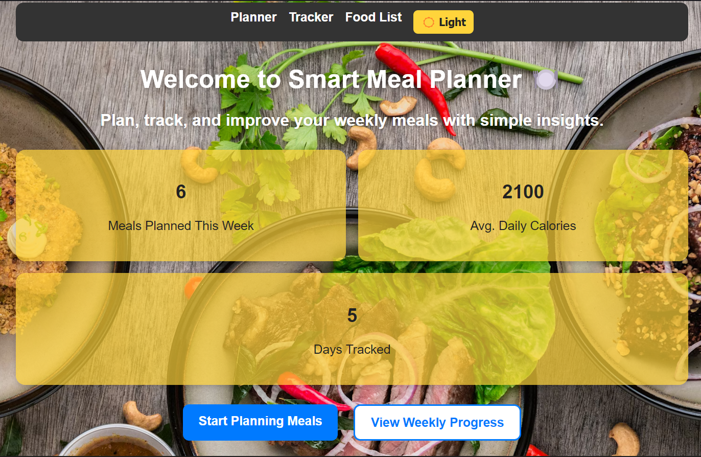

🥗 Smart Meal Planner

Smart Meal Planner is a modern React-based web application designed to help users plan, track, and analyze their meals effortlessly. It provides a clean, responsive UI with dark/light mode, interactive charts, and local storage support to keep your meal data safe and accessible.

🌟 Features

📅 Weekly Meal Planner – Plan your meals for each day of the week.

🍽️ Meal Tracker – Log calories, protein, and carbs for every meal.

📊 Progress Visualization – View nutritional progress through dynamic charts.

🌗 Dark & Light Mode – Seamlessly toggle between themes.

💾 Auto Save – Your data is stored locally for quick access.

⚡ Responsive Design – Works smoothly on all devices.

🚀 Tech Stack

Frontend: React.js

Routing: React Router

Charts: Recharts

Icons: React Icons

Styling: CSS-in-JS & custom components

Clone this repository:(git clone https://github.com/Nardos124/smart-meal-planner.git)
screenshot of smart-meal-planar

